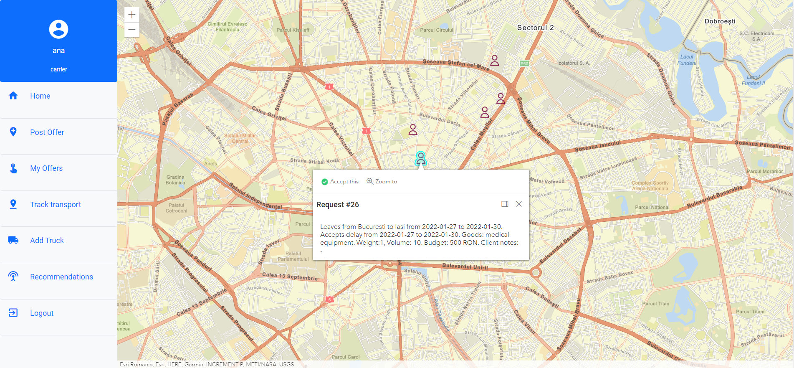

# TransMap

TransMap is an app that provies an easy to use transport service. It allows 2 types of custumers: carrier (posts offers and manages the transport) and client (the one that needs transportation). Both user types can accept offers/requests via the map if it fits their needs. In addition, the app automates the contract making process between client-carrier. Moreover, TransMap allows interactive tracking of their transport.


## Overview 




**More APP ScreenShots --->** [here](https://github.com/andreitivga/TransMap/tree/master/app_overview)


## Technologies
- [Angular 12.1.1](https://angular.io/)
- [ArcGIS API for JavaScript](https://developers.arcgis.com/javascript/latest/api-reference/)
- [Angular Material](https://material.angular.io/)
- [Ng Boostrap](https://ng-bootstrap.github.io/#/home)
- [Pyton 3.8.10](https://www.python.org/downloads/release/python-3810/)
- [Flask](https://flask.palletsprojects.com/en/2.0.x/)
- [SQLite](https://www.sqlite.org/index.html)


## Usage & Installation

```bash
  https://github.com/andreitivga/TransMap.git
  cd TransMap/server
  pip install -r requirements.txt
  python app.py
  
  cd ../TransMap/client
  npm install
  npm start
```

## Contributions
- [Andrei Tivga](https://github.com/andreitivga)
- [Iulia Anghel](https://github.com/iuliiaioana)
- [Nicoleta Palade](https://github.com/nicoletap99)

